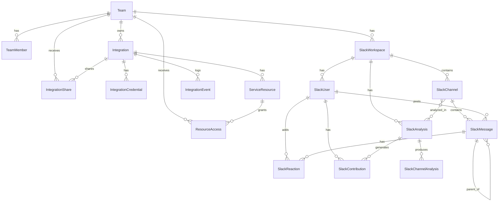

# Database Schema Documentation

This document provides a comprehensive overview of the database schema for the Toban Contribution Viewer application.

## Overview

The application uses PostgreSQL with SQLAlchemy as the ORM (Object-Relational Mapper) and Alembic for migrations. The database is structured around three main conceptual groups:

1. **Team Management**: Teams, users, and permissions
2. **Integration Framework**: A shared integration system supporting multiple service types
3. **Slack Components**: Specialized tables for Slack workspace and analysis data

## Entity Relationship Diagram



## Table Descriptions

### Team Management

#### Team

Central organizational unit that groups users and resources.

| Column              | Type         | Description                                |
|---------------------|--------------|--------------------------------------------|
| id                  | UUID         | Primary key                                |
| name                | String(255)  | Team name                                  |
| slug                | String(255)  | URL-friendly identifier (unique)           |
| description         | Text         | Team description                           |
| avatar_url          | String(1024) | Team avatar URL                            |
| team_size           | Integer      | Team size                                  |
| is_personal         | Boolean      | Whether this is a personal team            |
| team_metadata       | JSONB        | Additional team properties                 |
| created_by_user_id  | String(255)  | User who created the team                  |
| created_by_email    | String(255)  | Email of the creating user                 |
| created_at          | DateTime     | Creation timestamp                         |
| updated_at          | DateTime     | Last update timestamp                      |

#### TeamMember

Represents a user's membership in a team with specific role.

| Column              | Type              | Description                             |
|---------------------|-------------------|-----------------------------------------|
| id                  | UUID              | Primary key                             |
| team_id             | UUID (FK)         | References Team                         |
| user_id             | String(255)       | External user identifier                |
| email               | String(255)       | User email                              |
| display_name        | String(255)       | User display name                       |
| role                | Enum              | OWNER, ADMIN, MEMBER, or VIEWER         |
| invitation_status   | String(50)        | Invitation status                       |
| invitation_token    | String(255)       | Token for invitation                    |
| invitation_expires_at | DateTime        | Invitation expiry                       |
| last_active_at      | DateTime          | Last activity timestamp                 |
| created_at          | DateTime          | Creation timestamp                      |
| updated_at          | DateTime          | Last update timestamp                   |

### Integration Framework

#### Integration

Core entity representing a connection to an external service (Slack, GitHub, etc.).

| Column              | Type              | Description                             |
|---------------------|-------------------|-----------------------------------------|
| id                  | UUID              | Primary key                             |
| name                | String(255)       | Integration name                        |
| description         | Text              | Integration description                 |
| service_type        | Enum              | SLACK, GITHUB, NOTION, or DISCORD       |
| status              | Enum              | ACTIVE, DISCONNECTED, EXPIRED, etc.     |
| integration_metadata| JSONB             | Service-specific configuration          |
| last_used_at        | DateTime          | Last usage timestamp                    |
| workspace_id        | String(255)       | External workspace identifier           |
| owner_team_id       | UUID (FK)         | References Team                         |
| created_by_user_id  | String(255)       | User who created the integration        |
| created_at          | DateTime          | Creation timestamp                      |
| updated_at          | DateTime          | Last update timestamp                   |

#### IntegrationCredential

Securely stores authentication tokens and API keys for integrations.

| Column              | Type              | Description                             |
|---------------------|-------------------|-----------------------------------------|
| id                  | UUID              | Primary key                             |
| integration_id      | UUID (FK)         | References Integration                  |
| credential_type     | Enum              | OAUTH_TOKEN, API_KEY, etc.              |
| encrypted_value     | String(2048)      | Encrypted token/key                     |
| expires_at          | DateTime          | Expiration timestamp                    |
| refresh_token       | String(2048)      | Encrypted refresh token                 |
| scopes              | JSONB             | Permissions granted                     |
| created_at          | DateTime          | Creation timestamp                      |
| updated_at          | DateTime          | Last update timestamp                   |

#### ServiceResource

Represents resources within external services (channels, repos, etc.).

| Column              | Type              | Description                             |
|---------------------|-------------------|-----------------------------------------|
| id                  | UUID              | Primary key                             |
| integration_id      | UUID (FK)         | References Integration                  |
| resource_type       | Enum              | SLACK_CHANNEL, GITHUB_REPO, etc.        |
| external_id         | String(255)       | ID in external service                  |
| name                | String(255)       | Resource name                           |
| resource_metadata   | JSONB             | Additional properties                   |
| last_synced_at      | DateTime          | Last sync timestamp                     |
| created_at          | DateTime          | Creation timestamp                      |
| updated_at          | DateTime          | Last update timestamp                   |

#### IntegrationShare

Controls sharing of integrations between teams.

| Column              | Type              | Description                             |
|---------------------|-------------------|-----------------------------------------|
| id                  | UUID              | Primary key                             |
| integration_id      | UUID (FK)         | References Integration                  |
| team_id             | UUID (FK)         | References Team                         |
| share_level         | Enum              | FULL_ACCESS, LIMITED_ACCESS, READ_ONLY  |
| status              | String(50)        | Share status                            |
| revoked_at          | DateTime          | Revocation timestamp                    |
| shared_by_user_id   | String(255)       | User who shared the integration         |
| created_at          | DateTime          | Creation timestamp                      |
| updated_at          | DateTime          | Last update timestamp                   |

#### ResourceAccess

Provides fine-grained access control for specific resources.

| Column              | Type              | Description                             |
|---------------------|-------------------|-----------------------------------------|
| id                  | UUID              | Primary key                             |
| resource_id         | UUID (FK)         | References ServiceResource              |
| team_id             | UUID (FK)         | References Team                         |
| access_level        | Enum              | READ, WRITE, ADMIN                      |
| granted_by_user_id  | String(255)       | User who granted access                 |
| created_at          | DateTime          | Creation timestamp                      |
| updated_at          | DateTime          | Last update timestamp                   |

#### IntegrationEvent

Audit log for integration-related actions.

| Column              | Type              | Description                             |
|---------------------|-------------------|-----------------------------------------|
| id                  | UUID              | Primary key                             |
| integration_id      | UUID (FK)         | References Integration                  |
| event_type          | Enum              | CREATED, SHARED, UPDATED, etc.          |
| details             | JSONB             | Event details                           |
| actor_user_id       | String(255)       | User who performed the action           |
| affected_team_id    | UUID (FK)         | References Team                         |
| created_at          | DateTime          | Creation timestamp                      |
| updated_at          | DateTime          | Last update timestamp                   |

### Slack Components

#### SlackWorkspace

Represents a connected Slack workspace.

| Column              | Type              | Description                             |
|---------------------|-------------------|-----------------------------------------|
| id                  | UUID              | Primary key                             |
| team_id             | UUID (FK)         | References Team                         |
| slack_id            | String(255)       | Slack workspace ID                      |
| name                | String(255)       | Workspace name                          |
| domain              | String(255)       | Workspace domain                        |
| icon_url            | String(1024)      | Workspace icon URL                      |
| team_size           | Integer           | Team size                               |
| workspace_metadata  | JSONB             | Additional properties                   |
| is_connected        | Boolean           | Connection status                       |
| connection_status   | String(50)        | Status details                          |
| last_connected_at   | DateTime          | Last connection timestamp               |
| last_sync_at        | DateTime          | Last sync timestamp                     |
| access_token        | String(1024)      | Encrypted access token                  |
| refresh_token       | String(1024)      | Encrypted refresh token                 |
| token_expires_at    | DateTime          | Token expiration timestamp              |
| created_at          | DateTime          | Creation timestamp                      |
| updated_at          | DateTime          | Last update timestamp                   |

#### SlackChannel

Represents a channel within a Slack workspace.

| Column                  | Type              | Description                             |
|-------------------------|-------------------|-----------------------------------------|
| id                      | UUID              | Primary key                             |
| workspace_id            | UUID (FK)         | References SlackWorkspace               |
| slack_id                | String(255)       | Slack channel ID                        |
| name                    | String(255)       | Channel name                            |
| type                    | String(50)        | public, private, im, mpim               |
| purpose                 | String(1024)      | Channel purpose                         |
| topic                   | String(1024)      | Channel topic                           |
| member_count            | Integer           | Number of members                       |
| is_archived             | Boolean           | Archived status                         |
| created_at_ts           | String(50)        | Slack timestamp of creation             |
| has_bot                 | Boolean           | Whether bot is in channel               |
| bot_joined_at           | DateTime          | Bot join timestamp                      |
| is_selected_for_analysis| Boolean           | Whether channel is selected for analysis|
| is_supported            | Boolean           | Whether channel is supported            |
| last_sync_at            | DateTime          | Last sync timestamp                     |
| oldest_synced_ts        | String(50)        | Oldest synced message timestamp         |
| latest_synced_ts        | String(50)        | Latest synced message timestamp         |
| created_at              | DateTime          | Creation timestamp                      |
| updated_at              | DateTime          | Last update timestamp                   |

#### SlackUser

Represents a user within a Slack workspace.

| Column              | Type              | Description                             |
|---------------------|-------------------|-----------------------------------------|
| id                  | UUID              | Primary key                             |
| workspace_id        | UUID (FK)         | References SlackWorkspace               |
| slack_id            | String(255)       | Slack user ID                           |
| name                | String(255)       | Username                                |
| display_name        | String(255)       | Display name                            |
| real_name           | String(255)       | Real name                               |
| email               | String(255)       | Email address                           |
| title               | String(255)       | Job title                               |
| phone               | String(50)        | Phone number                            |
| timezone            | String(100)       | Timezone string                         |
| timezone_offset     | Integer           | Timezone offset                         |
| profile_image_url   | String(1024)      | Profile image URL                       |
| is_bot              | Boolean           | Whether user is a bot                   |
| is_admin            | Boolean           | Whether user is an admin                |
| is_deleted          | Boolean           | Whether user is deleted                 |
| profile_data        | JSONB             | Additional profile data                 |
| created_at          | DateTime          | Creation timestamp                      |
| updated_at          | DateTime          | Last update timestamp                   |

#### SlackMessage

Represents a message in a Slack channel.

| Column              | Type              | Description                             |
|---------------------|-------------------|-----------------------------------------|
| id                  | UUID              | Primary key                             |
| channel_id          | UUID (FK)         | References SlackChannel                 |
| user_id             | UUID (FK)         | References SlackUser                    |
| parent_id           | UUID (FK)         | References SlackMessage (self)          |
| slack_id            | String(255)       | Slack message ID                        |
| slack_ts            | String(50)        | Slack timestamp                         |
| text                | Text              | Message text                            |
| processed_text      | Text              | Text after resolving mentions           |
| message_type        | String(50)        | message, bot_message, etc.              |
| subtype             | String(50)        | Message subtype                         |
| is_edited           | Boolean           | Whether message was edited              |
| edited_ts           | String(50)        | Edit timestamp                          |
| has_attachments     | Boolean           | Whether message has attachments         |
| attachments         | JSONB             | Attachment data                         |
| files               | JSONB             | File data                               |
| thread_ts           | String(50)        | Thread parent timestamp                 |
| is_thread_parent    | Boolean           | Whether message is a thread parent      |
| is_thread_reply     | Boolean           | Whether message is a thread reply       |
| reply_count         | Integer           | Number of replies                       |
| reply_users_count   | Integer           | Number of users in thread               |
| reaction_count      | Integer           | Number of reactions                     |
| message_datetime    | DateTime          | Message datetime                        |
| is_analyzed         | Boolean           | Whether message has been analyzed       |
| message_category    | String(100)       | question, answer, etc.                  |
| sentiment_score     | Float             | Message sentiment score                 |
| analysis_data       | JSONB             | Analysis data                           |
| created_at          | DateTime          | Creation timestamp                      |
| updated_at          | DateTime          | Last update timestamp                   |

#### SlackReaction

Represents an emoji reaction to a Slack message.

| Column              | Type              | Description                             |
|---------------------|-------------------|-----------------------------------------|
| id                  | UUID              | Primary key                             |
| message_id          | UUID (FK)         | References SlackMessage                 |
| user_id             | UUID (FK)         | References SlackUser                    |
| emoji_name          | String(255)       | Emoji name                              |
| emoji_code          | String(255)       | Emoji code                              |
| reaction_ts         | String(50)        | Reaction timestamp                      |
| created_at          | DateTime          | Creation timestamp                      |
| updated_at          | DateTime          | Last update timestamp                   |

#### SlackAnalysis

Represents a Slack contribution analysis.

| Column              | Type              | Description                             |
|---------------------|-------------------|-----------------------------------------|
| id                  | UUID              | Primary key                             |
| workspace_id        | UUID (FK)         | References SlackWorkspace               |
| created_by_user_id  | UUID              | User who created the analysis           |
| name                | String(255)       | Analysis name                           |
| description         | Text              | Analysis description                    |
| start_date          | DateTime          | Analysis start date                     |
| end_date            | DateTime          | Analysis end date                       |
| parameters          | JSONB             | Custom analysis parameters              |
| llm_model           | String(255)       | LLM model used                          |
| analysis_type       | String(50)        | Analysis type                           |
| is_scheduled        | Boolean           | Whether analysis is scheduled           |
| schedule_frequency  | String(50)        | daily, weekly, monthly                  |
| next_run_at         | DateTime          | Next scheduled run                      |
| status              | String(50)        | Analysis status                         |
| progress            | Float             | Progress percentage                     |
| error_message       | Text              | Error message                           |
| result_summary      | JSONB             | Summary of results                      |
| completion_time     | DateTime          | Completion timestamp                    |
| created_at          | DateTime          | Creation timestamp                      |
| updated_at          | DateTime          | Last update timestamp                   |

#### SlackContribution

Represents user contribution scores from analysis.

| Column                  | Type              | Description                             |
|-------------------------|-------------------|-----------------------------------------|
| id                      | UUID              | Primary key                             |
| analysis_id             | UUID (FK)         | References SlackAnalysis                |
| user_id                 | UUID (FK)         | References SlackUser                    |
| channel_id              | UUID (FK)         | References SlackChannel                 |
| problem_solving_score   | Float             | Problem solving score                   |
| knowledge_sharing_score | Float             | Knowledge sharing score                 |
| team_coordination_score | Float             | Team coordination score                 |
| engagement_score        | Float             | Engagement score                        |
| total_score             | Float             | Total contribution score                |
| message_count           | Integer           | Number of messages                      |
| thread_reply_count      | Integer           | Number of thread replies                |
| reaction_given_count    | Integer           | Number of reactions given               |
| reaction_received_count | Integer           | Number of reactions received            |
| notable_contributions   | JSONB             | Notable message IDs and reasons         |
| insights                | Text              | Generated insights text                 |
| insights_data           | JSONB             | Structured insights data                |
| created_at              | DateTime          | Creation timestamp                      |
| updated_at              | DateTime          | Last update timestamp                   |

#### SlackChannelAnalysis

Stores detailed results from LLM analysis of Slack channels.

| Column              | Type              | Description                             |
|---------------------|-------------------|-----------------------------------------|
| id                  | UUID              | Primary key                             |
| analysis_id         | UUID (FK)         | References SlackAnalysis                |
| channel_id          | UUID (FK)         | References SlackChannel                 |
| start_date          | DateTime          | Analysis start date                     |
| end_date            | DateTime          | Analysis end date                       |
| message_count       | Integer           | Number of messages analyzed             |
| participant_count   | Integer           | Number of participants                  |
| thread_count        | Integer           | Number of conversation threads          |
| reaction_count      | Integer           | Number of reactions                     |
| channel_summary     | Text              | Overall channel summary                 |
| topic_analysis      | Text              | Analysis of discussion topics           |
| contributor_insights| Text              | Insights about contributors             |
| key_highlights      | Text              | Key highlights from the channel         |
| model_used          | String(255)       | LLM model used                          |
| generated_at        | DateTime          | Generation timestamp                    |
| raw_response        | JSONB             | Full LLM response                       |
| status              | String(50)        | Analysis status                         |
| error_message       | Text              | Error message                           |
| created_at          | DateTime          | Creation timestamp                      |
| updated_at          | DateTime          | Last update timestamp                   |

## Key Relationships

1. **Team Membership**:
   - A Team has many TeamMembers
   - A Team owns many Integrations
   - A Team can be shared with via IntegrationShare
   - A Team can access resources via ResourceAccess

2. **Integration Structure**:
   - An Integration belongs to a Team (owner)
   - An Integration has many IntegrationCredentials
   - An Integration has many ServiceResources
   - An Integration can be shared with many Teams

3. **Slack Data Model**:
   - A SlackWorkspace belongs to a Team
   - A SlackWorkspace has many SlackChannels and SlackUsers
   - A SlackChannel contains many SlackMessages
   - A SlackMessage belongs to a SlackChannel and a SlackUser
   - A SlackMessage can have many SlackReactions
   - A SlackAnalysis produces many SlackContributions and SlackChannelAnalyses

## Indexes and Constraints

The schema includes various indexes and constraints to ensure data integrity and query performance:

1. **Unique Constraints**:
   - Team slug
   - TeamMember team_id/user_id
   - Integration owner_team_id/workspace_id/service_type
   - IntegrationShare integration_id/team_id
   - ServiceResource integration_id/resource_type/external_id
   - ResourceAccess resource_id/team_id
   - SlackWorkspace slack_id
   - SlackChannel workspace_id/slack_id
   - SlackUser workspace_id/slack_id
   - SlackReaction message_id/user_id/emoji_name
   - SlackChannelAnalysis analysis_id/channel_id

2. **Performance Indexes**:
   - SlackMessage channel_id/slack_ts
   - SlackMessage user_id/slack_ts
   - SlackMessage message_datetime
   - SlackMessage thread_ts

## Database Management

### Migration Commands

```bash
# Check current migration
alembic current

# View migration history
alembic history

# Create a new migration
alembic revision --autogenerate -m "description_of_changes"

# Apply all pending migrations
alembic upgrade head

# Apply to a specific version
alembic upgrade <revision_id>

# Revert to previous version
alembic downgrade -1
```

### Setup Commands

```bash
# Set up a new database
python scripts/setup_database.py

# For a complete reset (WARNING: destroys all data)
python scripts/setup_database.py --reset
```

## Best Practices

1. **Always use migrations** for schema changes
2. **Test migrations** before applying to production
3. **Back up your database** before applying migrations in production
4. **Review migration files** carefully to avoid unexpected changes
5. **Use meaningful commit messages** when adding migrations
6. **Document schema changes** in code comments and PR descriptions